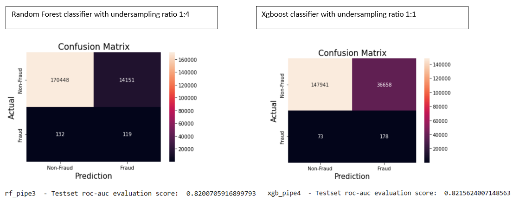

# Fraud Providers Detection with Medicare data


## Introduction
In the United States, Medicare is the federal health insurance program for people ages 65 and over, regardless of income, medical history, or health status. Due to the increasing of elderly population and outbreak of infectious diseases, the Medicare expenses will be increasing more aggressively. CBO projects that between 2021 and 2032, the net Medicare spending, after subtracting premiums and other offsetting receipts, will grow as a share of both the federal budget, from 10.1% to 17.8%, and the nation’s economy, from 3.1% to 4.3% of gross domestic product (GDP) (Source: [KFF analysis of Medicare spending data from Medicare Trustees report, April 2022.](https://www.kff.org/medicare/issue-brief/what-to-know-about-medicare-spending-and-financing/#:~:text=CBO%20projects%20that%20between%202021,gross%20domestic%20product%20(GDP).)). Medicare fraud occurs when someone knowingly deceives Medicare to receive payment when they should not, or to receive higher payment than they should. The Federal Bureau of Investigation (FBI) estimates that fraud accounts for up to 10% of all billings within the Medicare program, about $65 billion in financial loss per year.(Source: [Medicare and the ACA: Shifting the paradigm of fraud detection](https://mds.marshall.edu/cgi/viewcontent.cgi?article=1171&context=mgmt_faculty)). So, there are great needs for an efficient and automatic healthcare system to detect fraud.

This project aims to mitigate financial losses and ensure the integrity of the insurance system by leveraging predictive machine learning models to detect fraud providers using Medicare data provided by CMS


## Data sources
### The project has 3 different sources
- [Medicare Part B](https://data.cms.gov/provider-summary-by-type-of-service/medicare-physician-other-practitioners/medicare-physician-other-practitioners-by-provider-and-service): Providing claims information for each procedure a physician performs
within a given year.
- [Medicare Part B Summary by Provider data](https://data.cms.gov/provider-summary-by-type-of-service/medicare-physician-other-practitioners/medicare-physician-other-practitioners-by-provider): Describing the providers overall billing activities across all procedure codes.
- [LEIE data for fraud labeling](https://oig.hhs.gov/exclusions/exclusions_list.asp): List of Excluded Individuals and Entities for providers, which contains the following information: reason for exclusion, date of exclusion and reinstate/waiver date for all current physicians found unsuited to practice medicine and thus excluded from practicing in the United States for a given period of time.

### The reason we selected Part B and Part B Summary by Provider data for our analysis
The Part B dataset includes both provider-level and procedure-level attributes, including the amounts charged for procedures, the number of beneficiaries receiving the procedure, and the payment reimbursed by Medicare. Those information will be more helpful to building our models, as we can create summary statatistics for each providers based on the procedure-level attributes. In literature review, we searched through papers adopting CMS data sourses such as Part B, Part D and DMEPOS. There is no significant difference regarding the AUC evaluation performance among these 3 datasets.\
Part B Summary by Provider data can help with addtional information for each provider after joining to our Part B aggregated dataset, which will enrich our aggregated dataset with new numeric features and improve the models evaluation performance.

### Labeling using LEIE database
[LEIE database](https://oig.hhs.gov/exclusions/exclusions_list.asp) is updated monthly, and the current LEIE fraud labels can only reflect the current existing providers. As we were exploring the providers from 2013 to 2021, when some providers might be identified as fraud at that time, but later reinstated because the minimum extension duration was hit or the provider received a waiver. Those details can not be included in the latest LEIE data and the previously identified fraud can be gone. Due to the extremely small proportions of fraud providers, we need to expand the fraud labeling as much as possible, otherwise we will get so many false negative labels. To solve this problem, we leveraged two additional approaches:
- An [Internet Archive tool](https://archive.org/web/) was used to download all the available monthly archived exclusions and reinstatements data from 2013 to 2023. Then, we aggregated the monthly data with the most recent updated LEIE Database and the LEIE Database archieved in December 2012, and dropped the duplicated records afterwards - This could be the most completed database including all the available fraud records from database build-up upto now.

- In [LEIE database](https://oig.hhs.gov/exclusions/exclusions_list.asp), there are great amount of providers not having a NPI (National Provider Identifier) information, expecially for the data collected before 2013. We leveraged additonal joining approach for the providers not being identified and merged by NPI when joining to the Part B dataset. This approach help increase about 4\% for the fraud label, which is almost 200 fraud labels among the 2013-2021.


## Downloading the Data
1) To download all the available [Medicare Part B data](https://data.cms.gov/provider-summary-by-type-of-service/medicare-physician-other-practitioners/medicare-physician-other-practitioners-by-provider-and-service), just click the download button and select data range from 2013 to 2021, then hit 'Download Files', the yearly Part B data will be downloaded separatedly for each individual year. (Data samples can be found at data/PartB folder)

2) To download all the available [Medicare Part B Summary by Provider data](https://data.cms.gov/provider-summary-by-type-of-service/medicare-physician-other-practitioners/medicare-physician-other-practitioners-by-provider), just click the download button and select data range from 2013 to 2021, then hit 'Download Files', the yearly Part B Summary by Provider data will be downloaded separatedly for each individual year. (Data samples can be found at data/PartB_provider folder)

3) To download the archived monthly exclusion and reinstatement data from 2013 to the currrent year, we leveraged an [Internet Archive tool](https://archive.org/web/) to access the LEIE database (Source: [Data‑Centric AI for Healthcare Fraud Detection](https://link.springer.com/article/10.1007/s42979-023-01809-x)) in each historical month from Janurary 2013, and downloaded the exclusion and reinstatement files, respectively, until June 2023. (Data samples can be found at data/LEIE folder) \
In addition, the other three cumulative LEIE database were downloaded based on below datacuts:
      - [06-2023 Updated LEIE Database](https://oig.hhs.gov/exclusions/downloadables/UPDATED.csv)
      - [01-2023 Updated LEIE Database](https://web.archive.org/web/20230306062338/https://oig.hhs.gov/exclusions/downloadables/UPDATED.csv)
      - [12-2012 Updated LEIE Database](https://web.archive.org/web/20130115211318/https://oig.hhs.gov/exclusions/downloadables/updatedleie.zip)

## Intermediate datasets:
Note: All the intermediate datasets in full size can be downloaded at this [Google Drive](https://drive.google.com/drive/folders/1HxvleTx326J3vMswHrBULi_Bc_Ul03uh).
- all_exclusion_providers_from_2013_to_2023.csv: The exclusion data from 2013 Jan to 2023 June combined from historical monthly dataset (located at folder data/LEIE/all_exclu_from_2013) - please find the **notebook 1.1** for this step at preprocessing folder.
- all_reinstate_providers_from_2013_to_2023.csv: The reinstatement data from 2013 Jan to 2023 June combined from historical monthly dataset (located at folder data/LEIE/all_rein_from_2013) - please find the **notebook 1.2** for this step at preprocessing folder.
- year2013_to_2023_combined_with_labels.csv: The final cleaned dataset after joining all datasets for labeling the fraudulent providers. (Sample dataset located at folder data) - please find the **notebook 1.3** for this step at preprocessing folder. 
- year2013_2014_combined_with_labels.csv: the subset of year2013_to_2023_combined_with_labels.csv for calendar years 2013 and 2014, which will be used as the input data for all the downstream unsupervised and supervised learning approaches (Sample dataset located at folder data) - - please find the **notebook 1.3** for this step at preprocessing folder.


## Model Requirements and Installation
Prior to running the model please install and set up the project dependencies with the requirements .txt file. 

```
pip install -r requirements.txt
```

## Unsupervised Learning

To exploring the data patterns, we built a 3D rendering of the Medicare data with the fraud labels ("1") embedded in the whole population displayed in the high dimensional spaces.


Two dimensionality reduction pipelines were built to be applied to the enriched Part B dataset with 89 features included.(find script at unsupervised_learning/Unsupervised_learning_components_extraction.ipynb)

   - Truncated SVD: Working with a sparse matrix in place of a dense numpy matrix which can sometimes cause out-of-memory issues depending on the machine where the code is running.

   - Incremental PCA: Designed to iterate over a dataset and fits a PCA model over mini subsets of the whole dataset. This allows for large datasets to be fed to the model and not cause an out-of-memory error.

A data-viz pipeline was built to illustrate the details about the explained variance of each component individually and the model as a whole. 

Additionally, a pipeline was built for automating the whole process of finding the optimal K for a K-Means cluster model.(find script at unsupervised_learning/auto_K_finder.ipynb)

With the dimensionality reduction by SVD and PCA with 3 components, we are able to capture 99\% of the variance from the original dataset.The original dataset has 80+ numerical features. By distilling the original dataset down to 3 components and keeping so much of the information from the whole dataset, we should see a huge increase in speed for the downstream supervised learning models training and optimization.

## Supervised Learning
### Exploration of over/down-sampling techniques to deal with unbalanced labels
Logistic regression was used as a baseline model to explore the best ratio of oversampling or oversampling or hybrid sampling approaches.(please find the notebook 2.1, 2.2, 2.3 and 2.4 under the supervised-learning folder for details)

From the above table, we observed that undersampling could delivery more promising roc-auc scores with the default setting of a logistic regression model, which are equivalent or better than the scores captured by modeling on data without any resampling techniques, and it can help speedup the training and optimization process, given our huge dimensional spaces with about 90 features and 2 million instances.

In addition, dimensionality reduction algorithms such as Truncated SVD and MiniBatch PCA can speedup the downstream supervised learning approach, but they are not preferable due to the mediocre evaluation scores and lack of models explanation capability.

### Classifiers selection and models tuning
Based on the exploration results, we determined applying downsampling technique with 4 different minority/majority label ratios (1:10, 1:4, 1:2 and 1:1), we would select Logistic Regression, Random Forest, Xgboost and LightGBM with our enriched Part B datasets, which has 80+ numerical features and is expected to deliver better evaluation results. (please find the notebook 3.1, 4.1 and 5.1 under the supervised-learning folder)


## Feature Contributions
To explore the features having the most contributions and improve the model explanations, we leveraged [SHAP (SHapley Additive exPlanations)](https://shap.readthedocs.io/en/latest/) technique and used the average SHAP value to visualize the top 15 features for the enriched Part B dataset with implementing a LightGBM model. (please find the script in notebook 8.2 under the supervised-learning folder)


